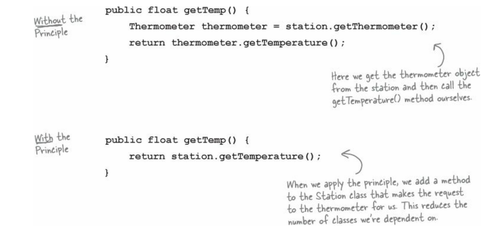

# Facade Pattern

**Decorator Pattern:** This doesn’t alter interface, but adds responsibility.

**Adapter Pattern:** Convert one interface to another.

**Facade Pattern:** Makes an interface simpler.

To use the **Facade Pattern**, we create a class that simplifies and unifies a set of more complex classes that belong to some subsystem

<aside>
💡 **Principle of Least Knowledge**: talk only to your immediate friends.
</aside>

